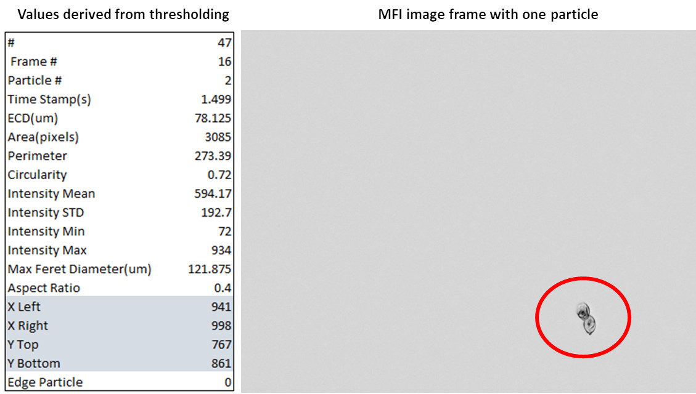

<h1>
Computer Vision with Deep Learning
</h1>
<h3>
Course Project @ FHNW
</h3>

<i>29.01.2022</i>

<i>Claudio Schmidli</i>

<em>Abstract</em>

<em>This project investigates the application of deep learning models for the classification of particle images obtained through Micro-Flow Imaging (MFI). The study explores various pre-trained models, transfer learning, and fine-tuning techniques to address the challenge of classifying imbalanced datasets, containing images of particles in pharmaceutical formulations. The results indicate that fine-tuned pre-trained models, especially ensembles, perform best in terms of accuracy and F1 score. The project demonstrates that deep learning techniques can extract more meaningful insights from MFI data compared to traditional thresholding methods. Depending on the deployment location, models such as MobileNet are recommended for edge devices, while the ensemble model is more suitable for environments where performance is less critical. The findings contribute to advancing the understanding of particle characteristics in drug manufacturing, providing a solid foundation for further research and application.</em>

<em>Summary Table of Model Performance</em>

| Rank | Model Name                     | Type                              | Trainable Parameters | Accuracy Val | Accuracy Test | F1 Val | F1 Test |
|------|---------------------------------|-----------------------------------|----------------------|--------------|---------------|--------|---------|
| 1    | Model Ensemble                 | ResNet50 + MobileNet              | 24M                  | n/a          | 0.9401        | n/a    | 0.9284  |
| 2    | InceptionV3                    | Fine-tuning                       | 22M                  | 0.9600       | 0.9288        | 0.9288 | 0.9180  |
| 3    | RESNET50_FINE_TUNE             | Fine-tuning                       | 24M                  | 0.9400       | 0.9316        | 0.9298 | 0.9169  |
| 4    | Transfer_Learning_MobileNet    | Transfer Learning                 | 20K                  | 0.9114       | 0.9116        | 0.8994 | 0.9031  |
| 5    | ResNet34                        | Self-constructed ResNet34         | 26M*                 | 0.8942       | 0.9002        | 0.8716 | 0.8895  |
| 6    | RESNET50_FROM_ZERO             | Train from Scratch                | 24M                  | 0.8886       | 0.8945        | 0.8705 | 0.8832  |
| 7    | Simple_FC_Network              | Simple FC Network from Scratch    | 151K                 | 0.5285       | 0.3455        | 0.5351 | 0.3650  |

# Introduction
Micro-flow imaging (MFI) is a technique used in the drug manufacturing industry to study subvisible particles in pharmaceutical formulations. This information is crucial for the development and quality control of pharmaceutical products. In most studies, particle concentrations in different size ranges are reported. The data obtained by MFI is collected using a digital camera. The sample is passed through a flow cell, where the camera captures particle images in high resolution. Compared to other methods, this also provides visual information. However, the image data is not used to its full extent. Existing data processing methods are based on thresholding, which is the simplest method of image segmentation. The binary image transformation generated in this way lacks information for more sophisticated data analysis. **Figure 1** shows the sparse data provided by the manufacturer's software.

In this notebook, I show an alternative image analysis approach based on neuronal networks. Six different models were developed to classify pixel images. I demonstrate that neuronal networks can provide valuable information about the different particle types in pharmaceutical formulations.

**Figure 1:** *Right: MFI image frame containing one single particle (could be more than one). Left: Particle characteristics provided by the MFI software. The numbers are based on image thresholding.*

# Methodology
### Creation of dataset
In order to train CNN models, a dataset had to be created first. Therefore, three different biolocigal samples consisting of antibodies and saliva were measured. In this way, several thousands of image frames were collected. Following that, the raw data, which included images and CSV files, was processed in Python with the notebook <a href="data_collection and_analysis/MFI_Analysis_Main.ipynb"> data_collection and_analysis/MFI_Analysis_Main.ipynb</a> (confidential, not shown here). The script depends on a config.ini file and input parameters defined in Excel. During the execution a logs are written in a .log file. The script reads the raw data, calculates different particle concentrations, and crops every particle using the thresholding approach mentioned above. In this way, a dataset of 2338  was created. The generated particle images were then manually labeled into five classes as follows: 
- 826 Bubbles 
- 202 Cells
- 380 Dark 
- 281 Fiber
- 650 Protein

As you can see, this is an imbalanced dataset. E.g., bubbles are more represented than cells. To deal with this, all models were trained by applying class weights.

### Load and preprocess dataset
To load and preprocess the dataset a class named **Data** was written. The class is build on <a href="https://www.tensorflow.org/api_docs/python/tf/data">tf.data</a> for a finer control. 

The class provides the following functionality:
- Read image data
- Read image labels from image path
- Calculate the class weight for each class
- Perform train/val/test split based on given parameters (70% train, 15% val and 15% test was used later on)
- Image resizing by scaling, cropping or zero padding with black values (zero-padding has no effect on the classification accuracy but considerably reduces the training time, see <a href="https://journalofbigdata.springeropen.com/articles/10.1186/s40537-019-0263-7">this paper</a>)
- Rescale image to values between 0 and 1 
- Image caching
- Image batching
- Image augmentation (flip images) This was only performed on the training data!
- Prefetching

<h2>For more details on this project click here go to <a href="./main.ipynb"> main.ipynb</a><h3>
